# 🔖 IoT Badge Scanner

A two-component Python service for **QR-code-based employee badge check-ins**, built as part of a larger integration platform. A Raspberry Pi-class client reads badge QR codes via webcam and forwards scan events to a backend server, which validates them and fans the events out over **RabbitMQ** to the rest of the system.

---

## Table of Contents

- [Architecture Overview](#architecture-overview)
- [Repository Structure](#repository-structure)
- [Components](#components)
  - [Client](#client)
  - [Server](#server)
  - [Shared](#shared)
- [Message Flows](#message-flows)
- [Configuration](#configuration)
- [Running Locally](#running-locally)
- [Running with Docker](#running-with-docker)
- [CI / Quality Gates](#ci--quality-gates)
- [Team](#team)

---

## Architecture Overview

```mermaid
sequenceDiagram
    autonumber
    participant Cam as 📷 Camera
    participant Client as Client<br/>(edge device)
    participant Server as Server<br/>(backend)
    participant DB as SQLite<br/>(users_muuid_table)
    participant MQ as RabbitMQ

    %% ── Check-in flow ──────────────────────────────────────────
    rect rgb(30, 50, 80)
        note over Cam,MQ: Check-in Flow
        Cam->>Client: raw video frame
        Client->>Client: detect QR code (OpenCV)
        Client->>Client: adaptive brightness normalisation
        Client->>Server: POST / {"id": "<muuid>"}
        Server->>DB: SELECT muuid
        alt MUUID unknown
            DB-->>Server: no rows
            Server-->>Client: 403 Forbidden
        else MUUID known
            DB-->>Server: row found
            Server->>Server: build & validate CheckIn XML (XSD)
            Server->>MQ: publish → user.checkin.topic<br/>routing.controlroom.user.checkin
            Server-->>Client: 200 OK
            Client->>Client: 3-second cooldown
        end
    end

    %% ── CRM enrolment flow ─────────────────────────────────────
    rect rgb(30, 70, 50)
        note over MQ,DB: CRM Enrolment Flow
        MQ->>Server: consume ← contact.topic<br/>badgescanner.user.confirmed
        Server->>Server: parse XML → extract muuid
        Server->>DB: INSERT muuid
        Server->>MQ: basic_ack
    end

    %% ── Heartbeat flow ─────────────────────────────────────────
    rect rgb(70, 40, 30)
        note over Server,MQ: Heartbeat Flow (every 30 s)
        loop every HEARTBEAT_INTERVAL seconds
            Server->>Server: build & validate Heartbeat XML (XSD)
            Server->>MQ: publish → heartbeat.direct<br/>routing.heartbeat
        end
    end
```



---

## Repository Structure

```
iot-badge-scanner/
├── client/                  # Edge device service (camera + HTTP bridge)
│   ├── main.py              #   Entry point: camera loop & stream server
│   ├── Dockerfile           #   Container image for the scanner device
│   ├── docker-compose.yml   #   Compose stack: scanner + Home Assistant + go2rtc
│   ├── requirements.txt
│   └── .env.example
├── server/                  # Backend service (validation + RabbitMQ publisher)
│   ├── main.py              #   Entry point: HTTP handler + consumers + heartbeat
│   ├── Dockerfile
│   ├── requirements.txt
│   ├── .env.example
│   └── xsd/
│       ├── checkin.xsd      #   XML schema for check-in events
│       └── heartbeat.xsd    #   XML schema for heartbeat events
├── shared/
│   └── logger.py            # Shared structured logger (stdout + RabbitMQ)
├── tests/
│   └── test_server.py       # Unit tests for XML generation & validation
├── ha_config/
│   └── configuration.yaml   # Home Assistant configuration stub
├── pyproject.toml           # Ruff & pytest configuration
└── .github/workflows/ci.yml # GitHub Actions CI pipeline
```

---

## Components

### Client

> **Location:** `client/`  
> **Runtime:** Python 3.13 · OpenCV · Requests

The client runs on an edge device (e.g. Raspberry Pi) connected to a USB or CSI camera.

| Feature | Detail |
|---|---|
| **QR detection** | OpenCV `QRCodeDetector` with multi-code support |
| **Brightness normalisation** | Adaptive scaling to handle over- and under-exposed frames |
| **Check-in forwarding** | HTTP POST to the server's `/checkin` endpoint |
| **MJPEG stream** | Live annotated video at `http://<host>:<port>/stream.mjpg` |
| **Home Assistant** | Integrated via the compose stack for a local dashboard |
| **go2rtc** | RTSP re-streaming sidecar for low-latency access |

After a successful QR scan, the client enforces a **3-second cooldown** before the next scan to prevent duplicate events.

**Key environment variables (`client/.env.example`):**

```env
HA_HOST=0.0.0.0
HA_PORT=8080
API_URL=http://localhost:3000/checkin
```

---

### Server

> **Location:** `server/`  
> **Runtime:** Python 3.13 · Pika · lxml

The server is a lightweight HTTP service that acts as the authoritative gateway between the scanner client and the broader integration platform.

#### Responsibilities

1. **Badge validation** — Checks that the scanned MUUID exists in a local SQLite database (`users_muuid_table`) that is populated by CRM confirmations arriving over RabbitMQ.
2. **XML construction & validation** — Builds check-in and heartbeat payloads as XML and validates them against XSD schemas before publishing.
3. **RabbitMQ publishing** — Publishes validated events with configurable retry logic (linear backoff).
4. **Heartbeat loop** — Emits a `Heartbeat` XML message to the `heartbeat.direct` exchange every N seconds (default: 30 s) so the control room can monitor service health.
5. **CRM consumer** — Subscribes to `badgescanner.user.confirmed` and persists new MUUIDs, enabling real-time user enrolment without a restart.

#### HTTP API

| Method | Path | Body | Response |
|---|---|---|---|
| `POST` | `/` | `{"id": "<muuid>"}` | `200 OK` / `400` / `403` / `500` |

> Returns `403 Forbidden` for unrecognised badge IDs.

#### RabbitMQ Topology

| Exchange | Type | Routing Key | Direction |
|---|---|---|---|
| `user.checkin.topic` | topic | `routing.controlroom.user.checkin` | publish |
| `heartbeat.direct` | direct | `routing.heartbeat` | publish |
| `contact.topic` | topic | `crm.user.confirmed` | consume |

**Key environment variables (`server/.env.example`):**

```env
RABBITMQ_HOST=
RABBITMQ_PORT=
RABBITMQ_USER=
RABBITMQ_PASS=

EXTERNAL_PORT=
INTERNAL_HOST=
```

Additional tuning variables:

| Variable | Default | Description |
|---|---|---|
| `HEARTBEAT_INTERVAL_SECONDS` | `30` | Seconds between heartbeat publishes |
| `RABBITMQ_PUBLISH_RETRIES` | `3` | Max publish attempts per message |
| `RABBITMQ_PUBLISH_RETRY_DELAY_SECONDS` | `0.5` | Base delay between retries (linear backoff) |
| `LOG_LEVEL` | `INFO` | Python log level (`DEBUG`, `INFO`, `WARNING`, …) |

---

### Shared

> **Location:** `shared/`

A small utility package consumed by both client and server.

- **`get_logger(name)`** — Configures the root logger once (respects `LOG_LEVEL`) and returns a named logger.
- **`RabbitMQLogger`** — Optional logger that serialises log events as XML and publishes them to the `logs.direct` exchange for centralised log aggregation.
- **`LogEvent`** — Dataclass that serialises a structured log entry (service, level, timestamp, data) to XML.

---

## Message Flows

### Check-in Flow

```
Camera detects QR  →  Client POST /checkin  →  Server validates MUUID
  →  Build & validate CheckIn XML  →  Publish to user.checkin.topic
```

### CRM Enrolment Flow

```
CRM confirms user  →  contact.topic / crm.user.confirmed
  →  Server consumer stores MUUID in SQLite
  →  Badge is now accepted for check-in
```

### Heartbeat Flow

```
Every 30 s  →  Build & validate Heartbeat XML
  →  Publish to heartbeat.direct / routing.heartbeat
  →  Control room marks service as alive
```

---

## Running Locally

### Prerequisites

- Python 3.13
- A running RabbitMQ instance
- A webcam accessible as `/dev/video0` (client only)

### Server

```bash
cd server
cp .env.example .env          # fill in your RabbitMQ credentials
pip install -r requirements.txt
python main.py
```

### Client

```bash
cd client
cp .env.example .env          # set API_URL to point at the server
pip install -r requirements.txt
python main.py
```

---

## Running with Docker

The client directory ships a full Compose stack:

```bash
cd client
cp .env.example .env
docker compose up --build
```

This starts three containers:

| Container | Port(s) | Description |
|---|---|---|
| `scanner` | `5000` | Badge scanner client |
| `home-assistant` | `8123` | Home Assistant dashboard |
| `go2rtc` | `8554`, `1984` | RTSP / WebRTC stream relay |

The server has its own `Dockerfile` and is intended to be deployed separately as part of the wider integration platform.

```bash
# From the project root
docker build -f server/Dockerfile -t badge-scanner-server .
docker run --env-file server/.env badge-scanner-server
```

---

## CI / Quality Gates

GitHub Actions runs on every push and pull request to `main`:

| Step | Tool | Details |
|---|---|---|
| Lint | **Ruff** | `E`, `F`, `W` rules; line length 120; target Python 3.13 |
| Test | **pytest** | `tests/` — XML generation & XSD validation unit tests |

Run the same checks locally:

```bash
pip install ruff pytest
ruff check .
python -m pytest
```

---

## Team

| Role | Name |
|---|---|
| **Team Lead** | Abdellah El Morabit |
| Developer | Nasr |

> Part of the **Integration Project 2026 — Groep 2** integration platform.
